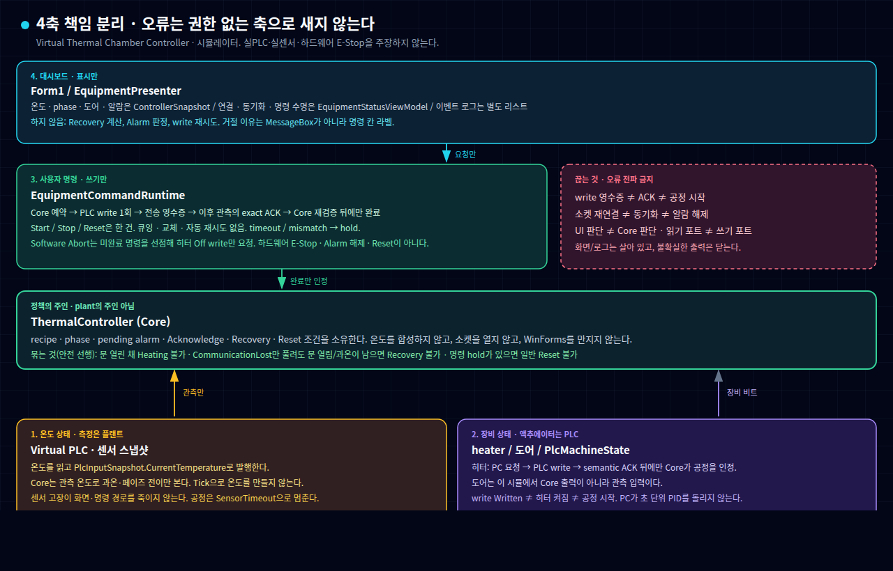

# Virtual Thermal Chamber Controller

WinForms 가상 열처리 챔버 제어 시뮬레이터입니다. UI, Core 제어 규칙, PLC I/O를 나누고, 인터록·명령 ACK·통신 손실·재연결을 자동 테스트로 확인합니다.

실제 챔버, 생산 PLC, Modbus, 온도 센서, 히터를 제어하지 않습니다. PC 인터록은 E-Stop·Safety PLC·하드웨어 안전회로를 대체하지 않습니다.

## 무엇인지

가상 열처리 챔버 **제어 규칙 시뮬레이터**입니다. 화면은 상태를 표시하고, Core가 Alarm·Recovery를 소유하며, Virtual PLC가 write와 ACK를 분리합니다.

## 어떤 어려운 문제를 증명하는가

연결만으로 복구하지 않습니다. write 성공은 공정 시작이 아니고, 소켓이 다시 붙었다고 동기화된 것도 아닙니다. `CommunicationLost`는 새 관측과 새 Acknowledge 뒤에만 Recovery-ready가 되며, 이 단계는 Reset 성공을 증명하지 않습니다. Software Abort는 히터 Off write 선점이며 하드웨어 E-Stop이 아닙니다.

## 시스템 구조

네 축이 맞물려 돌아가되, 한 축의 오류가 권한 없는 다른 축을 죽이지 않습니다.



| 축 | 하는 일 | 하지 않는 일 |
| --- | --- | --- |
| 온도 상태 | Virtual PLC가 온도 스냅샷을 발행 | Core가 온도를 합성하지 않음 |
| 장비 상태 | 히터·도어는 plant 비트 | `Written` ≠ 히터 켜짐 ≠ 공정 시작 |
| 사용자 명령 | 예약 → write 1회 → exact ACK | 자동 재시도 없음. timeout은 hold |
| 대시보드 | 온도와 연결·명령 수명을 표시 | Recovery를 계산하지 않음 |

상세 책임 경계와 검증 영수증: [`docs/architecture-and-verification.md`](docs/architecture-and-verification.md).

## 어떻게 확인하는가

마지막 Windows Release 검증: HEAD `4b32f42`, **209/209** (Abstractions 22, Core 47, Application 80, Presentation 33, Simulation 27). 2026-08-31 이 세션에서 `dotnet test --configuration Release` 재실행.

```powershell
dotnet restore ChamberControlSimulator.slnx
dotnet build ChamberControlSimulator.slnx --configuration Release --no-restore
dotnet test ChamberControlSimulator.slnx --configuration Release --no-build --no-restore
```

시나리오 테스트명: [`docs/verification/scenario-matrix.md`](docs/verification/scenario-matrix.md). 라이브 창: [`docs/verification/p7-t4-app-captures.md`](docs/verification/p7-t4-app-captures.md).

## 증거

| 증명 | 의미 | 근거 |
| --- | --- | --- |
| write와 ACK 분리 | 전송 영수증만으로 공정을 완료하지 않음 | [P4](docs/verification/p4-final-consistency-closure.md) |
| typed 통신 실패 → CommunicationLost | Stop/Reset으로 우회하지 않음 | [P5-T1](docs/verification/p5-t1-communication-lost.md) |
| 소켓 재연결 ≠ 동기화 | 새 소스 incarnation의 관측이 필요 | [P5-T3](docs/verification/p5-t3-source-synchronization.md) |
| 안전 입력 + 새 Ack → Recovery-ready | Reset 성공을 주장하지 않음 | [P5-T4](docs/verification/p5-t4-fresh-safe-recovery.md) |
| 복합 알람 / hold가 Recovery를 막음 | 통신만 풀려도 문 열림·과온이 남으면 불가 | [P5-T5](docs/verification/p5-t5-composite-alarms.md) |
| UI는 표시만 | 복구를 계산하지 않음. 거절은 명령 칸 | [P6-T1](docs/verification/p6-t1-status-rendering.md) |
| Software Abort ≠ E-Stop | 히터 Off write 선점 | [`p7-s13-abort.png`](docs/demo/images/p7-s13-abort.png) |

없는 증거: Reset 성공, Modbus/TCP, 실장비, 하드웨어 E-Stop/Safety PLC. ACK timeout / WaitingForFreshInput은 화면 대신 test+log.

## 재현 명령

Windows 저장소 루트에서 실행합니다.

```powershell
dotnet restore ChamberControlSimulator.slnx
dotnet build ChamberControlSimulator.slnx --configuration Debug --no-restore
dotnet test ChamberControlSimulator.slnx --configuration Debug --no-build --no-restore
```
