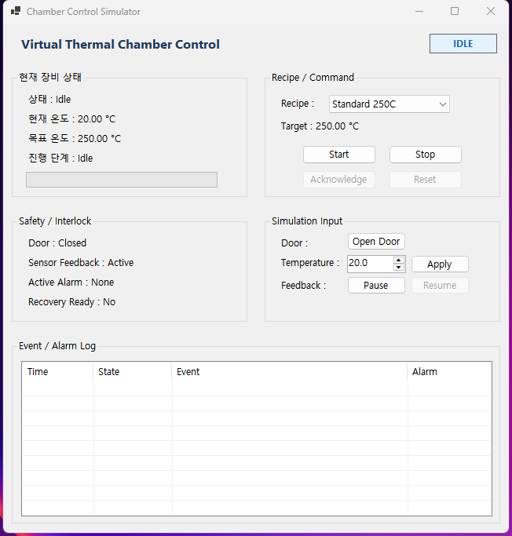
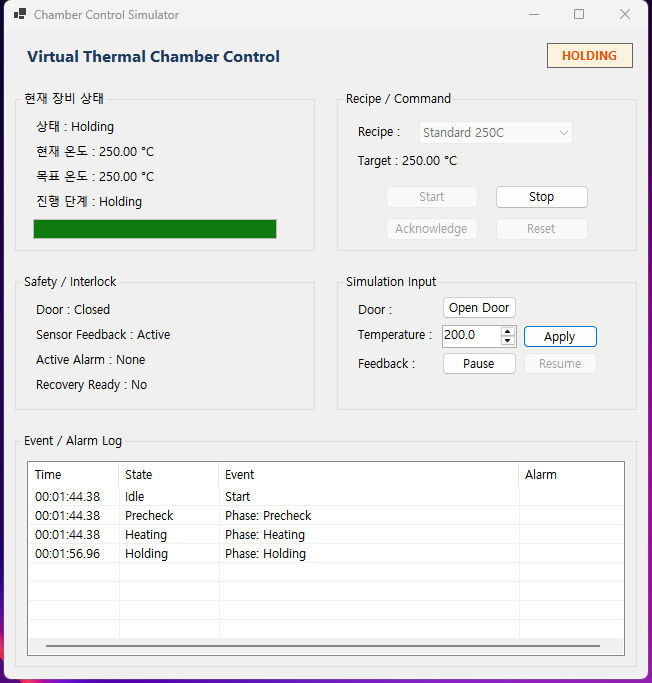
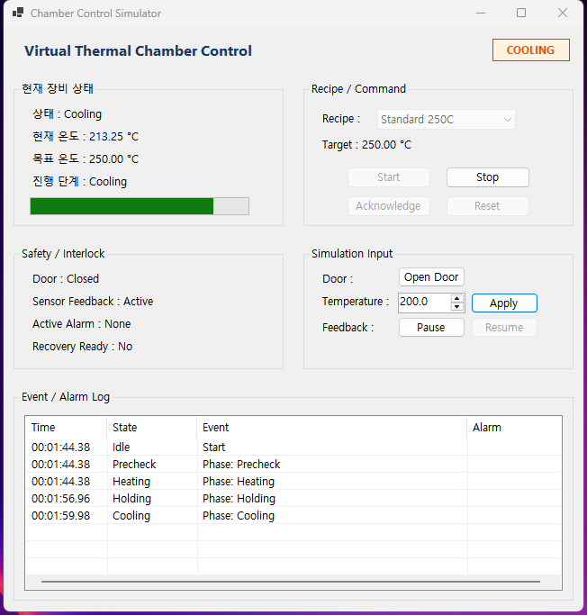
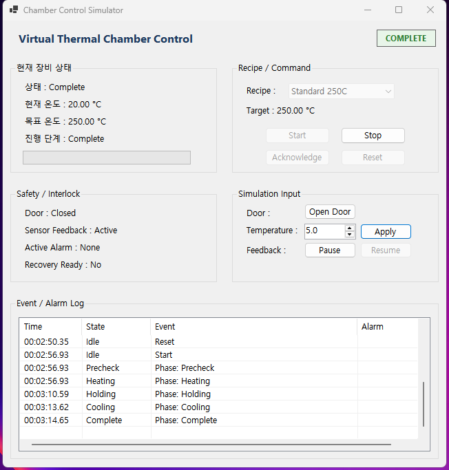
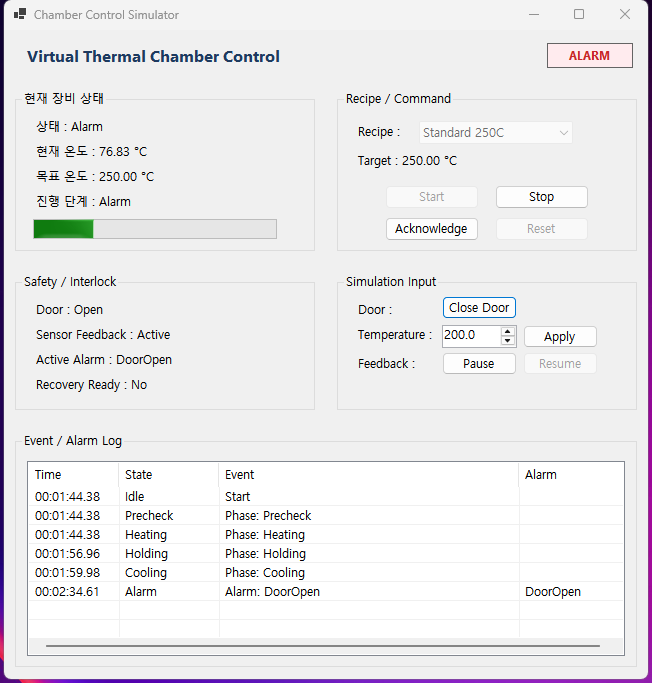
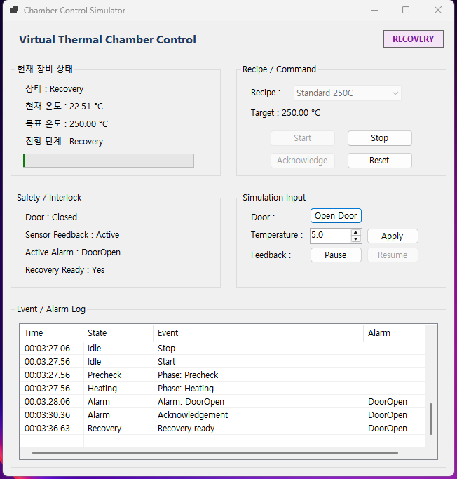
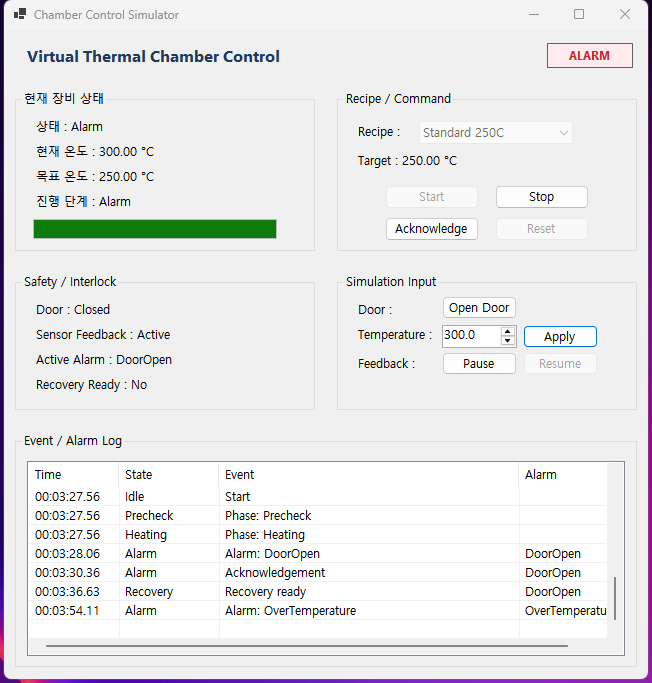
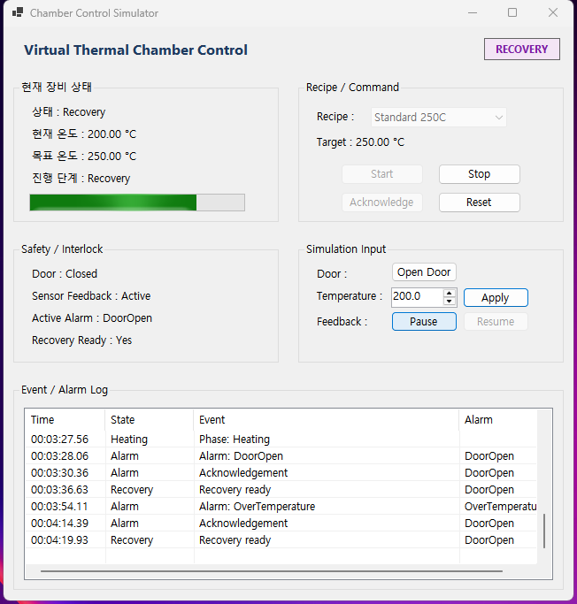
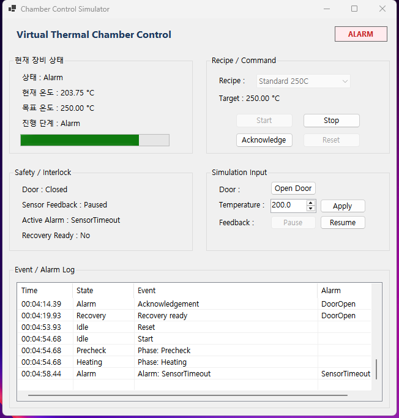
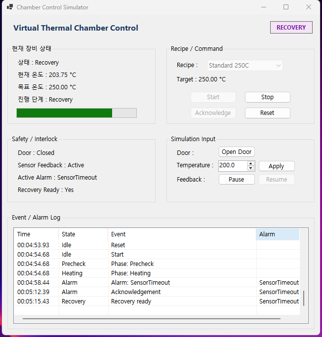

# 데모 시나리오

이 문서는 UI에서 재현할 수 있는 흐름과 자동 테스트 근거를 함께 기록한다. 이 프로젝트는 가상 시뮬레이터이며 실제 장비·PLC·온도 센서·히터를 제어하지 않는다.

실행 전 Visual Studio에서 `ChamberControlSimulator.slnx`를 열고 `ChamberControlSimulator`를 시작 프로젝트로 설정한다.

## 공통 확인 항목

모든 시나리오에서 다음 영역을 함께 확인한다.

- 상단 Controller state badge
- Equipment Status: 상태, 현재/목표 온도, Door, Sensor Feedback, Active Alarm, Recovery Ready
- Event History의 최신 행
- Safety / Simulation Input 버튼의 enabled 상태

캡처를 추가할 때는 앱 창만 포함하고, 다른 프로그램·바탕화면·개인 정보는 프레임에 넣지 않는다.

## 1. 정상 공정과 Holding

1. Recipe가 `Standard 250C`인지 확인한다.
2. **Start**를 누른다.
3. `Heating`을 거쳐 `Holding` badge가 보이는 동안 Event History를 확인한다.
4. Holding은 기본 3초가 지난 뒤 `Cooling`으로 전이한다.
5. ambient temperature에 도달하면 `Complete`가 보이는지 확인한다.

기대 결과:

```text
Idle → Precheck → Heating → Holding → Cooling → Complete
```

자동 근거:

```text
Start_ValidRecipe_ProgressesThroughNormalPhasesToComplete
```

### 화면 증거



- `IDLE`, `Standard 250C`, 현재 온도 `20.00 °C`, Door `Closed`, Sensor Feedback `Active`, Active Alarm `None`
- Start 활성화, Acknowledge·Reset 비활성화



- `HOLDING`, 현재·목표 온도 `250.00 °C`, Door `Closed`, Active Alarm `None`
- Event / Alarm Log: `Start → Phase: Precheck → Phase: Heating → Phase: Holding`



- `COOLING`, 현재 온도 `213.25 °C`, Door `Closed`, Active Alarm `None`
- Event / Alarm Log에 `Phase: Cooling`이 추가된 중간 전이



- `COMPLETE`, Active Alarm `None`
- Event / Alarm Log에 `Precheck → Heating → Holding → Cooling → Complete`가 순서대로 기록됨

## 2. DoorOpen Alarm과 Recovery

1. Idle에서 **Start**를 눌러 active phase로 진입한다.
2. **Open Door**를 누른다.
3. `Alarm` badge와 `Active Alarm : DoorOpen`을 확인한다.
4. **Close Door**를 누른다.
5. **Acknowledge**를 누른다.
6. `Recovery`와 `Recovery Ready : Yes`를 확인한다.
7. **Reset**을 눌러 `Idle`로 돌아가는지 확인한다.

기대 결과:

```text
active phase → Alarm(DoorOpen) → Recovery → Idle
```

자동 근거:

```text
OpenDoor_WhileHeating_EntersDoorOpenAlarm
Reset_AfterDoorAlarmIsClosedAndAcknowledged_ReturnsToIdle
```

### 화면 증거



- `ALARM`, Door `Open`, Active Alarm `DoorOpen`, Recovery Ready `No`, Acknowledge 활성화
- Event / Alarm Log 마지막 행: `Alarm: DoorOpen`



- `RECOVERY`, Door `Closed`, Active Alarm `DoorOpen`, Recovery Ready `Yes`, Reset 활성화
- Event / Alarm Log: `Alarm: DoorOpen → Acknowledgement → Recovery ready`

## 3. OverTemperature Alarm과 Recovery

1. `Standard 250C` Recipe를 선택한다. safety temperature는 300C다.
2. **Start**를 누른다.
3. Simulation Input에 `300`을 넣고 **Apply Temperature**를 누른다.
4. `Alarm` badge와 `Active Alarm : OverTemperature`을 확인한다.
5. Simulation Input을 `299` 이하로 바꾸고 **Apply Temperature**를 누른다.
6. **Acknowledge**를 누른다.
7. `Recovery`가 보이는지 확인한 뒤 **Reset**을 눌러 Idle로 돌아간다.

자동 근거:

```text
ReportTemperature_AtSafetyLimit_AlarmsUntilTemperatureIsBelowLimit
```

### 화면 증거



- 현재 온도와 Simulation Input이 `300.0 °C`이며 Event / Alarm Log에 `Alarm: OverTemperature`가 기록됨
- 이 캡처는 앞선 DoorOpen이 아직 pending인 복합 인터락 세션이다. 따라서 Safety / Interlock의 Active Alarm 표시는 `DoorOpen`이며, 단독 과온 Alarm 화면으로 해석하지 않는다.



- Event / Alarm Log에는 `Alarm: OverTemperature → Acknowledgement → Recovery ready`가 남음
- Active Alarm이 `DoorOpen`으로 남은 이유도 같은 pending interlock 때문이다. Reset은 모든 pending alarm이 clear된 뒤에만 가능하다.

이 화면은 여러 pending interlock을 함께 추적하는 흐름의 Event Log 증거다. fresh run의 단독 OverTemperature 상태·Recovery 조건은 위 UI 절차와 `ReportTemperature_AtSafetyLimit_AlarmsUntilTemperatureIsBelowLimit` 자동 테스트를 함께 근거로 사용한다.

## 4. SensorTimeout Alarm과 Recovery

1. Idle에서 **Start**를 누른다.
2. **Pause Feedback**을 누른다.
3. SensorTimeout(3초)을 넘길 때까지 기다린다.
4. `Alarm` badge와 `Active Alarm : SensorTimeout`을 확인한다.
5. **Resume Feedback**을 누른다.
6. 다음 positive Timer Tick이 처리된 뒤 **Acknowledge**를 누른다.
7. `Recovery`를 확인하고 **Reset**으로 Idle에 돌아간다.

중요: Resume 직후 즉시 Reset할 수 없어야 한다. Controller는 fresh positive Tick까지 기다린다.

자동 근거:

```text
FeedbackPaused_PastTimeout_RequiresResumeAndFreshTickBeforeReset
FeedbackPaused_AfterTimeout_DoesNotRepeatedlyReassertSensorTimeout
```

### 화면 증거



- `ALARM`, Sensor Feedback `Paused`, Active Alarm `SensorTimeout`, Recovery Ready `No`
- Event / Alarm Log 마지막 행: `Alarm: SensorTimeout`



- `RECOVERY`, Sensor Feedback `Active`, Active Alarm `SensorTimeout`, Recovery Ready `Yes`, Reset 활성화
- Event / Alarm Log: `Alarm: SensorTimeout → Acknowledgement → Recovery ready`
